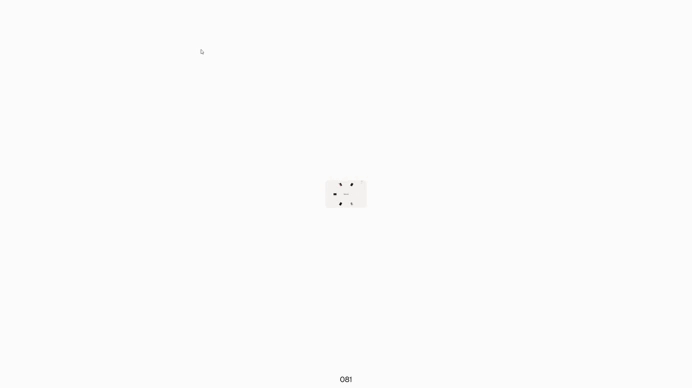

<h1 align="center">
  <span style="color:#7C3AED">🌀</span>
  <span> Zeta</span><span style="color:#7C3AED">Hub</span>
</h1>

<p align="center">
  Por si quieres ver — <a href="https://zetahubvercel.vercel.app"><strong>Live Demo</strong></a>
</p>

<p align="center">
  
</p>

---

## ¿Qué es este proyecto?

**ZetaHub** es mi portal personal con todos mis proyectos en un solo lugar.
En vez de una grid de tarjetas normal, los proyectos se muestran como un
anillo que gira, renderizado como un único shader WebGL: no hay imágenes ni
tarjetas HTML, todo son campos de distancia (SDF) dibujados por píxel. Las
tarjetas vecinas se funden entre sí al acercarse y se estiran en hilos finos
al separarse.

- **Scroll o arrastrar** para girar el anillo.
- Pasar el cursor sobre la tarjeta centrada muestra su **vídeo** (tras un
  segundo) y un tag "Ver".
- Clic en una tarjeta lateral la centra; clic en la ya centrada abre su
  enlace.
- La lista de la esquina superior derecha también es clicable.

Este proyecto está basado en
[**Viscose**](https://github.com/Yousuf-developer/Viscose-carousel) de
Yousuf Soomro (MIT), portado de React/Next.js a JavaScript vanilla y
adaptado con mis propios proyectos, imágenes y vídeos.

---

## Tecnologías utilizadas

| Categoría | Tecnología |
|---|---|
| Render | Three.js (shader SDF a pantalla completa) |
| Animación | GSAP |
| Lenguaje | JavaScript (módulos ES, sin build) |
| Tipografías | Satoshi (Fontshare), Geist (SIL OFL) |
| Deploy | Vercel |

---

## Estructura del proyecto

```
index.html          punto de entrada
css/style.css        estilos, fuentes locales
js/
├── app.js             arranca el carrusel
├── carousel.js         bucle principal: input, física del anillo, hover del vídeo
├── ring/
│   ├── projects.js       los proyectos — editar aquí para añadir/quitar uno
│   ├── params.js          todos los parámetros ajustables
│   ├── techIcons.js       iconos de stack (HTML, CSS, Angular, Vue...)
│   ├── dom.js             construye el overlay (lista, meta, vídeo, tag)
│   ├── meta.js            morph de texto (nombre, tipo, descripción, stack)
│   ├── atlas.js           empaqueta las imágenes en una sola textura
│   ├── tag.js             tag "Ver" que sigue al cursor
│   ├── splitText.js       título de entrada, letra a letra
│   └── utils.js           helpers matemáticos
└── shaders/
    ├── planeShaders.js    el anillo: SDFs, fusión, cristal, tag
    └── textShaders.js     revelado del título letra a letra
assets/
├── proyects/front/*.png   imagen de cada proyecto
├── proyects/back/*.mp4    vídeo al hacer hover
├── proyects/icons/*.png   icono junto al nombre
└── fonts/                 Satoshi y Geist
```

---

## Cómo iniciar el proyecto

No hace falta `npm install`. Sirve la carpeta con cualquier servidor
estático, por ejemplo:

```bash
python -m http.server 5500
```

Y abre `http://localhost:5500`.

## Añadir un proyecto

Todo vive en `js/ring/projects.js`. Cada entrada:

```js
{
  file: "assets/proyects/front/nombre.png",
  icon: "assets/proyects/icons/nombre.png",
  video: "assets/proyects/back/nombre.mp4", // o null
  name: "Nombre",
  type: "SPA",                  // tipo de aplicación
  stack: ["angular", "ts"],      // claves de js/ring/techIcons.js
  year: "2026",
  url: "https://...",
  githubUrl: "https://github.com/...", // "#" para ocultar el botón
  description: "Una frase breve.",
}
```
